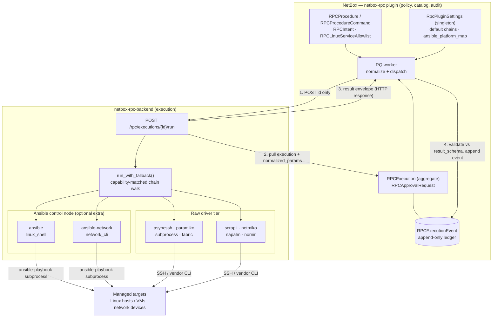
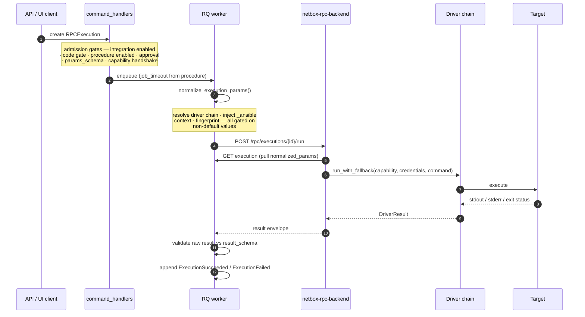
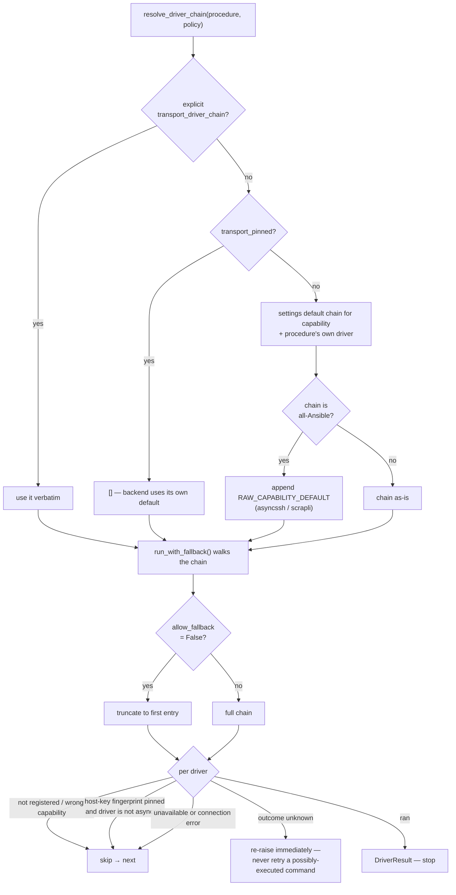

# netbox-rpc Architecture

`netbox-rpc` is the Remote Command Policy bounded context. It owns procedure
policy, execution audit state, normalization, and backend dispatch selection. It
does not own transport drivers or device protocol implementations; those live in
the paired executor, [`netbox-rpc-backend`](https://git.nmulti.cloud/N-MultiCloud/netbox-rpc-backend).

## System Architecture

The estate splits cleanly in two: **NetBox is the source of truth and the audit
boundary; the backend is the execution engine.** Ansible is the default way to
reach a target, but it is one driver tier among several rather than a hard
dependency.



**Dispatch is ID-only and pull-based.** The RQ worker POSTs
`/rpc/executions/{id}/run` carrying no payload (or a signed dispatch lease); the
backend then reads the execution — including `normalized_params` — back from the
NetBox API. Nothing about *what to run* travels in the request body.

### Execution lifecycle



Status never changes by direct mutation: it folds from the append-only stream
through `projection.apply()`. See [CQRS](#cqrs) and [Projection Fold](#projection-fold).

### Driver chain resolution and fallback

Ansible is the **default**, not a requirement. Two mechanisms keep it from
becoming a hard dependency: netbox-rpc appends a raw driver to any all-Ansible
chain, and the backend skips drivers it cannot use.



The **outcome-unknown** branch is the safety-critical one. If a driver loses the
connection after the remote process may already have started, advancing the
chain could execute a destructive command twice, so
`DriverCommandOutcomeUnknownError` propagates instead of falling back.

### Who decides what Ansible needs to know

The backend has no view of what a target *is* — an SSH credential carries no
platform. NetBox does, so **netbox-rpc resolves the Ansible connection settings**
and passes them down: the target's Platform slug maps through
`RpcPluginSettings.ansible_platform_map` to the `netbox.netbox`-conventional
`ansible_network_os` / `ansible_connection` pair, injected as
`normalized_params["_ansible"]` and recorded in the command fingerprint.

An unmapped platform injects nothing. The backend then reports its network
driver unavailable and falls back to a raw driver, which is far better than
guessing a vendor CLI dialect.

Injection is **gated on non-default values** throughout — driver, chain, parser,
schema, and `_ansible` are written only when they differ from the default — so
every legacy procedure keeps a byte-for-byte identical `normalized_params`
payload and an unchanged fingerprint.

### Boundary rules

- netbox-rpc never opens a connection to a target. It selects policy; the
  backend transports.
- The render context and captured output are substituted into commands by the
  executor, so the backend must shell-quote every rendered token and re-validate
  captured values. netbox-rpc must never store or accept arbitrary shell text.
- Ansible is invoked as a **subprocess** (`ansible-playbook`), never imported as
  a library — its Python API is explicitly unstable and the licence boundary
  matters.

For per-procedure authoring choices — which driver and parser to pick, parser
availability in production, and deploy ordering — see
[`transport-and-parsing-selection.md`](transport-and-parsing-selection.md). This
document covers the structure; that one covers the decisions.

## Domain Model

`RPCExecution` is the command aggregate and the NetBox-compatible read
projection. Django models remain the persistence boundary because NetBox
requires `NetBoxModel` for permissions, API serialization, object views, tags,
custom fields, and object deletion. The domain code therefore wraps the model
instead of introducing repository abstractions over the ORM.

The aggregate wrapper lives in `netbox_rpc.domain.aggregate` and enforces these
lifecycle invariants:

- terminal executions (`succeeded`, `failed`, `cancelled`) do not transition;
- only a queued execution can start;
- only a queued execution can be cancelled;
- `ExecutionQueued` is the first event in a new stream;
- normalized params and backend responses are recorded only for running
  executions.

`RPCProcedure`, `RPCProcedureCommand`, `RPCLinuxServiceAllowlist`, `RPCBackend`,
`RPCIntent` (with its `RPCIntentProcedure` through model), and
`RpcPluginSettings` are intentional reference-data/configuration entities. They
are ordinary NetBox CRUD models, audited by NetBox `ObjectChange`, and are not
event-sourced.

## Event Catalog

Typed domain events live in `netbox_rpc.domain.events`. `EVENT_TYPES` maps
persisted event names to dataclasses, and `from_record(name, data)` rebuilds
typed events from `RPCExecutionEvent` rows.

| Event | Projection effect |
|---|---|
| `ExecutionQueued` | status `queued` |
| `JobEnqueued` | `job_id` |
| `ExecutionStarted` | status `running`, `started_at` |
| `ParametersNormalized` | `normalized_params`, `resolved_command_hash` |
| `BackendEventRecorded` | no projection change; audit/progress only; remote names are capped and stored as `Backend::<name>` |
| `ExecutionSucceeded` | status `succeeded`, `result`, `finished_at`, clear errors |
| `ExecutionFailed` | status `failed`, `error_code`, `error_message`, `finished_at` |
| `ExecutionEnqueueFailed` | status `failed`, enqueue error fields, `finished_at` |
| `ExecutionCancelled` | status `cancelled`, `finished_at`, clear errors |

`RPCExecutionEvent` is append-only: ORM updates/deletes are rejected and the
database trigger layer protects the ledger below Django. Event append failures
fail closed through `RPCEventStoreError`.

For how these projections and events surface the issued command(s), their
output, and per-command/overall timing for a given `/core/jobs/<N>/` — with a
worked example — see [`rpc-generated-core-jobs.md`](./rpc-generated-core-jobs.md).

## Projection Fold

`netbox_rpc.domain.projection.apply(state, event)` is the canonical projection
definition. `rebuild(events)` folds from the initial queued state to prove that
the event stream can recreate the current projection.

`netbox_rpc.event_store` is the only gateway for execution state changes. Each
transition follows one path:

1. build a typed domain event;
2. append an `RPCExecutionEvent` with redaction, bounding, sequence collision
   retry, and `payload_hash`;
3. apply the pure reducer to compute the new `ProjectionState`;
4. write only changed projection fields back to `RPCExecution`.

`rebuild_projection(execution)` loads ordered events and folds them.
`reproject(execution)` writes the rebuilt state back to the model.

## CQRS

Command-side behavior lives in `netbox_rpc.application.command_handlers`:

- `create_execution(...)` checks execute permission, enabled state, approval
  policy, and JSON schema. Ordinary procedures emit `ExecutionQueued`, enqueue
  the RQ job, and emit `JobEnqueued` or `ExecutionEnqueueFailed`. Protected
  staging-token rotation and production Gitea upgrade procedures emit
  `ExecutionRequested` then `ApprovalRequested` and return
  `pending_approval` without enqueueing;
- `run_execution(execution)` starts the aggregate, resolves the backend,
  normalizes params, records normalization, calls the backend, and records the
  backend response. Every present inner result is schema-validated, including
  false envelopes. A truthy response can append `ExecutionSucceeded` only
  after validation; a false response keeps `failed` status but projects its
  valid closed result. Mismatch appends `ExecutionFailed` with
  `RPC_RESULT_SCHEMA_MISMATCH` and no malformed result. A resolver exception
  after claim is reduced to bounded `RPC_BACKEND_RESOLUTION_FAILED`, appends a
  terminal failure, and cannot strand the execution in `running` or contact a
  capability/dispatch endpoint;
- `cancel_execution(execution, user)` is a queued-only command that emits
  `ExecutionCancelled`.

### Approval enforcement status

The general catalog still uses the historical single-actor permission gate:
for most `approval_required` procedures, the requester must hold
`approve_rpcprocedure` and creation proceeds directly to `queued`. Those
objectless `user.has_perm(...)` admission checks do not preserve a concrete
procedure constraint; completing general object-scoped two-person enforcement
remains work under epic #163.

Issues #221 and #224 deliberately activate the full existing approval
foundation for `service.netbox.staging.rotate_backend_token` and
`service.gitea.production.upgrade_1_27_1` only:

- creation needs execute permission scoped to this exact procedure but cannot
  be self-approved inline; it records an immutable snapshot and
  `requested → pending_approval` without an RQ enqueue. Its request accepts no
  caller metadata outside the exact procedure/target/empty-params shape;
- `approve_execution()` requires approval permission scoped to this procedure
  (plus procedure view access), rejects the requester even if they are
  privileged, validates the immutable backend URL/TLS binding before sending
  authentication, requires a fresh uncached compatible capability while the
  execution row is locked, and recomputes the
  live protected snapshot, including canonical procedure-policy and
  params/result-schema hashes, and atomically records
  `approved → queued` before one job is enqueued. A binding or capability
  failure leaves the request pending without new events or a job;
- the `ExecutionApproved` projection persists `approved_by`; requester and
  approver IDs are read-only execution API fields and signed lease claims;
- admission, approval, worker claim, and pre-lease checks require the exact
  enabled name, handler, version, device target, destructive effect,
  1800-second timeout, approval bit, transport/output pipeline, representative
  command hash, and params/result schemas. The snapshot also binds the
  concrete backend ID and a non-secret URL/TLS identity fingerprint. They also
  require non-null distinct actors and revalidate the approval snapshot. Each
  authenticated capability probe validates the protected target first and the
  same resolved target is reused for snapshot, lease, and dispatch;
- approval and rejection accept no caller reason for this procedure; their
  durable event uses a fixed bounded audit phrase;
- both protected procedures require a signed one-time lease. Missing signing-key
  configuration fails with `RPC_DISPATCH_LEASE_REQUIRED` before the backend is
  contacted; ordinary procedures retain the backwards-compatible ID-only
  fallback.

Ordinary backend audit events are limited to 50 per response and namespaced as
`Backend::<name>` before append, so remote names cannot replay as internal
state-transition events. Protected procedures accept no backend events and
require the outer and nested result `ok` booleans to agree. The Gitea upgrade's
normalized target/fingerprint also pins VM PK 170, VMID 222, cluster/node/IPv4,
source/target versions, artifact digest, and target-owned SSH policy. Its public
SSH binding snapshot includes stable service/identity IDs plus canonical UTC
revisions, principal/method, locked host/port, and only a SHA-256 of the pinned
known-hosts entry. The raw entry and secret material are never projected.
Gitea capability and dispatch requests reject redirects. Its exact five-key
backend wrapper is validated at the HTTP boundary, but only `ok/result` crosses
into the event store; backend diagnostics are discarded and durable failure
text is selected from a fixed catalog mapping keyed by the closed result tuple.
For Gitea, the semantic capability contract additionally fixes backend ID 1,
loopback URL `http://127.0.0.1:16005`, and `verify_ssl=false`; the public Nginx
vhost is outside this dispatch path. The same semantic-contract digest is
included in the procedure-policy approval hash, so executable- or
backend-semantic drift invalidates requested, pending, approved, and queued
work before enqueue or lease issuance. The lease's existing `contract_hash`
binds those semantics without duplicating them in caller-controlled params or
a new wire claim.

`RPCApprovalRequest.expires_at` remains unenforced and general procedures are
not implicitly migrated by this scoped change. See `AGENTS.md` § "Two-person
approval workflow" for the operational contract.

Query-side helpers live in `netbox_rpc.application.queries`. Execution list,
detail, and event endpoints read projections. The execution API is
command-only for writes: create and cancel are explicit commands. PUT/PATCH are
disabled (state is derived from the event log, never edited), and DELETE is
disabled too — an execution and its append-only event ledger are immutable
history once created (a cascading delete would be rejected by the ledger's
append-only trigger). Execution records are retained, not deleted, by design.

## Normalization Boundary

Normalization lives in `netbox_rpc.domain.normalization`. `netbox_rpc.jobs`
re-exports the historical imports (`normalize_execution_params`,
`RPCExecutionError`, `_dispatch_normalize_execution_params`, and
`_apply_driver_pipeline_overrides`) for compatibility, but RQ job orchestration
delegates to application command handlers.

Procedure normalizers accept structured parameters only. They must not accept or
store arbitrary SSH command text. Driver/parser selection is injected centrally
from `RPCProcedure.transport_driver`, `output_parser`, and `output_schema`.


## Testing

The suite is two tiers:

1. **Fast pure-domain unit tests** (`tests/`, run by `pytest`): they stub Django
   and NetBox and need no database. They cover the domain logic — the projection
   `apply`/`rebuild` fold, typed domain events and their round-trips, the
   aggregate invariants, the value objects, the query helpers, and the
   normalization service — plus source-level contract checks. This is the
   `ci.yml` workflow. That ordinary Gitea job has one allowed runner label,
   `ci-untrusted-python312`, and queues fail-closed when it is unavailable; it
   has no mirror, production, generic self-hosted, or hosted fallback. The job
   pins checkout by full action SHA, checks out the triggering commit without
   persisted credentials, and verifies preprovisioned CPython 3.12.14 and uv
   0.12.5 at their fixed `/usr/local/bin` paths instead of trusting ambient
   `PATH` or downloading tools. `.gitea/ci-requirements.lock` is the
   canonical exact CPython 3.12 / x86_64 glibc 2.34 wheel closure. It is
   installed from an empty inherited environment with required hashes,
   wheel-only resolution, a fixed index, no project/config sources or cache,
   and Python downloads disabled. Syntax and test execution also use a minimal
   `env -i` plus Python isolated mode (`-I`) and disabled user site. Pytest uses
   a separate reviewed and hashed `.gitea/pytest-ci.ini`, an empty
   `PYTEST_ADDOPTS`, disabled plugin autoload, and only the explicitly loaded
   locked `pytest-asyncio` plugin, isolating it from candidate or runner Python
   paths, plugins, and collection/deselection options.
   A structural YAML and static mutation suite rejects extra jobs, write
   permissions, duplicate/alias/flow constructs, and weakening any dependency,
   toolchain, checkout, or test-execution boundary.
   This repository-side contract is defense in depth only: candidate workflows
   cannot define their own runner authority. The trusted Gitea
   repository/organization policy must make mirror and production-capable
   runners pull-request-ineligible and allow ordinary CI to match only the
   isolated label. CI stays blocked/queued until that platform prerequisite is
   demonstrably enforced.

2. **DB-backed integration tests** (`netbox_rpc/tests/`, run by
   `python netbox/manage.py test netbox_rpc` against a real Postgres test
   database): they cover the parts that only exist against the ORM — the
   `event_store` append+project path, the rebuild oracle (`rebuild_projection`
   reproduces the live projection for every lifecycle path), the append-only
   ledger (model guards + the database trigger; an execution with events cannot
   be deleted), the command handlers (create/run/cancel and the cancel-vs-start
   row-locked race), and the REST API (command-only write model: PUT/PATCH/DELETE
   return 405; cancel is an action; the event log is read-only). The required
   canonical Gitea pull-request gate needs an externally provisioned isolated
   untrusted runner, disposable digest-pinned PostgreSQL/Redis, and an exact
   hash-locked NetBox 4.5.8/4.6.5 dependency closure; it remains blocked until
   that trusted platform contract exists. The GitHub
   `.github/workflows/test.yml` matrix is supplementary post-mirror evidence,
   not canonical pre-merge evidence. Privileged Gitea `integration.yml` is a
   manual, canonical-`main`-only, non-gating operator diagnostic and never PR or
   push evidence. Platform runner/ref policy, not its candidate-visible guard,
   is authoritative.

Run them locally with:

```bash
# Tier 1 — fast, no database
pytest tests/

# Tier 2 — against a NetBox checkout + Postgres
python netbox/manage.py test netbox_rpc
```
