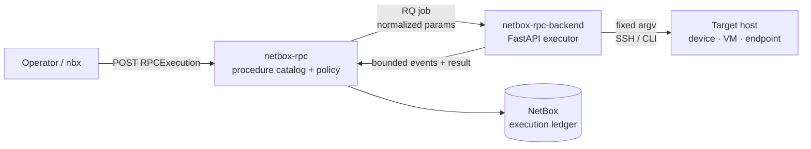
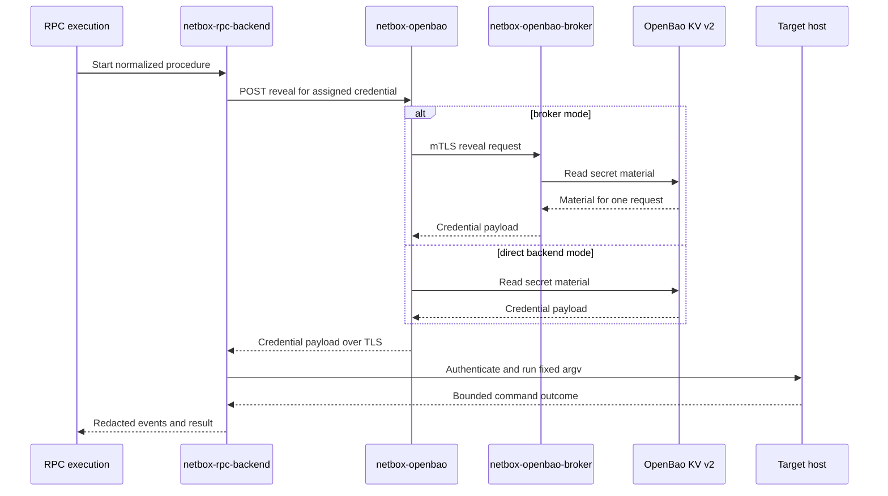
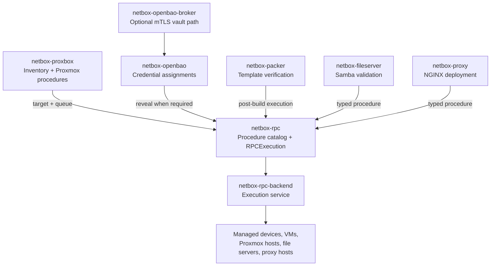

# Cross-plugin integrations

`netbox-rpc` is the policy and audit boundary for host operations in the
NetBox plugin ecosystem. It owns the procedure catalog, JSON schemas, approval
classification, execution records, and event ledger. It does not own SSH
drivers, vault clients, Proxmox discovery, image builds, Samba state, or NGINX
configuration.

The companion plugins meet the RPC catalog through declared procedures and
shared NetBox objects. They do not import each other's Python modules or open
ad-hoc shell sessions. This separation keeps each integration replaceable while
giving operators one execution history.

## Overview

The integration contract has three parts:

1. A companion plugin declares the procedure family it needs, including target
   models, structured parameters, effect, and result schema.
2. `netbox-rpc` validates and records the requested execution, then dispatches
   the normalized request to an `RPCBackend`.
3. `netbox-rpc-backend` performs fixed-argv SSH or CLI work and returns bounded,
   redacted events and results to the NetBox execution ledger.

The target object and its relationships remain the source of identity. A
procedure cannot create its own inventory or silently select a different host.

## Dispatch lane

`RPCProcedure.enabled`, `target_models`, JSON Schema validation, execute
permission, and approval classification are checked before enqueue. The
backend receives the contract selected by the catalog, not arbitrary command
text from the caller. Read-only diagnostics, writes, and destructive actions
remain distinguishable in the procedure row and execution history.

## Credential lane

Credentials are assigned to the target device, VM, or service through
`netbox-openbao`. Secret material is not copied into procedure parameters,
execution events, REST GET responses, or companion-plugin sync payloads.

`netbox-openbao-broker` is optional. When enabled, it holds the AppRole while
NetBox authenticates with a client certificate. In either mode, the reveal
permission and audit record stay in the OpenBao plugin, while RPC execution
records retain only the non-secret identity and outcome needed for operations.

## Plugin integrations

| Plugin | Shared boundary | RPC responsibility | Typical procedures |
|---|---|---|---|
| `netbox-rpc-backend` | `RPCBackend` URL and execution contract | Execute the catalogued operation | SSH/CLI transport, output capture, redaction |
| `netbox-openbao` | Credential and `CredentialAssignment` on the target | Provide audited reveal when login material is needed | Credential reveal, OpenBao host health and maintenance |
| `netbox-openbao-broker` | mTLS reveal path | Keep the AppRole outside the NetBox process | Brokered KV reads |
| `netbox-proxbox` | `ProxmoxEndpoint`, device, VM, and service inventory | Queue audited Proxmox host operations | Systemd service status and host probes |
| `netbox-packer` | Template and image-build records | Verify a baked template after build | SSH connectivity, agent, and service checks |
| `netbox-fileserver` | File-server and Samba inventory | Validate file-service state | Share listing and permission probes |
| `netbox-proxy` | NGINX cluster, virtual host, and upstream models | Deploy validated proxy configuration | Config test, deploy, reload, and rollback |

The cross-plugin map is intentionally one-way at the execution boundary:
companions submit a typed execution; `netbox-rpc` owns policy and history; the
backend owns host connectivity. Inventory, image creation, vault writes, and
configuration authoring remain in their respective plugins.

## Operator flow

1. Confirm that the target object exists in NetBox and that the required
   companion integration is enabled.
2. Assign the target's SSH material through `netbox-openbao` when the procedure
   needs credentials. The broker can mediate the vault read.
3. Select an enabled procedure or use a companion action that creates the same
   `RPCExecution` record. Review the target, parameters, effect, and approval
   requirement before submitting.
4. Approve only when the procedure's policy requires it. Destructive procedures
   are never implicitly approved by a companion trigger.
5. Follow execution events and inspect the bounded result. Use the execution
   history and ObjectChange records as the audit trail for the operation.

An unavailable backend, missing assignment, failed reveal, invalid parameter,
or non-success host outcome is a failed execution that must be reconciled by an
operator. It is not a reason to fall back to direct SSH from a plugin.

## Security and maintenance rules

- Caller input is validated as structured data and never becomes arbitrary
  shell text.
- Secret values do not enter `RPCExecution.params`, normalized parameters,
  events, results, logs, or companion sync payloads.
- Approval-required and destructive procedures remain visible in the catalog and
  require explicit human intent.
- A new host operation adds a catalogued procedure, schema, tests, and matching
  backend handler through the normal review workflow.
- If a capability is not represented by a procedure and execution history, it
  is not part of the supported integration surface.

## Further reading

- [Interactive cross-plugin diagrams](https://emersonfelipesp.com/netbox-rpc/integrations)
- [OpenBao broker and RPC architecture](https://github.com/emersonfelipesp/netbox-openbao/blob/main/docs/architecture/openbao-broker-rpc.md)
- [Proxbox RPC companion guide](https://github.com/emersonfelipesp/netbox-proxbox/blob/develop/docs/companion-plugins/netbox-rpc.md)
